# 📊 SƠ ĐỒ TRỰC QUAN - REDUX SAGA FLOW

## 🎯 Luồng tổng quan (Order List Feature)

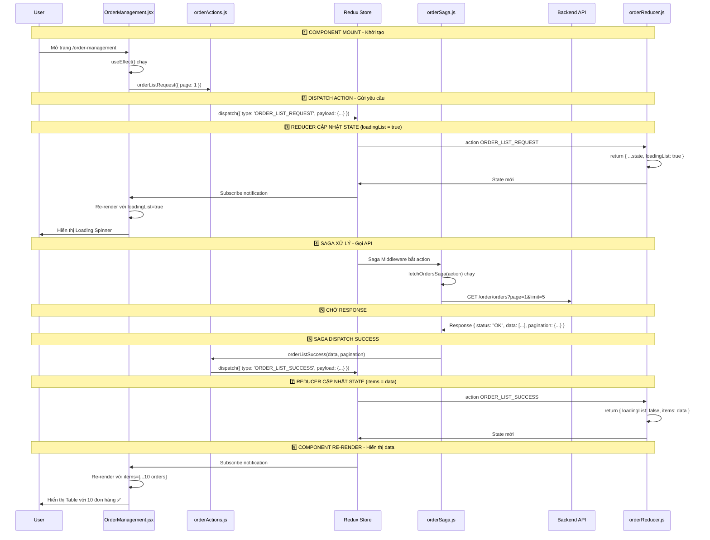

---

## 🔄 Vòng đời Redux Saga Flow

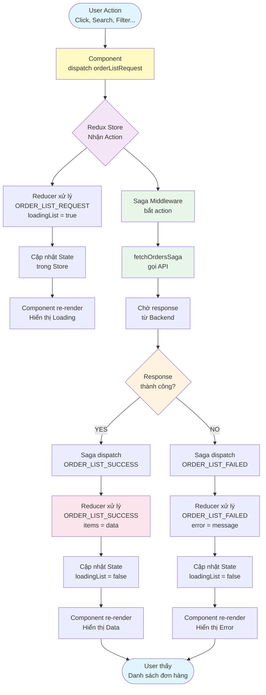

---

## 📦 Kiến trúc Redux Store

```mermaid
graph LR
    subgraph "Redux Store (store.js)"
        RootReducer[Root Reducer<br/>combineReducers]

        subgraph "State Tree"
            OrderState[order: {...}]
            ProductState[product: {...}]
            CartState[cart: {...}]
            AuthState[auth: {...}]
        end

        SagaMiddleware[Saga Middleware]

        subgraph "Root Saga"
            OrderSaga[orderSaga]
            ProductSaga[productSaga]
            CartSaga[cartSaga]
            AuthSaga[authSaga]
        end
    end

    RootReducer --> OrderState
    RootReducer --> ProductState
    RootReducer --> CartState
    RootReducer --> AuthState

    SagaMiddleware --> OrderSaga
    SagaMiddleware --> ProductSaga
    SagaMiddleware --> CartSaga
    SagaMiddleware --> AuthSaga

    style RootReducer fill:#f3e5f5
    style SagaMiddleware fill:#e8f5e9
    style OrderState fill:#fff9c4
    style OrderSaga fill:#e1f5ff
```

---

## 🎭 Chi tiết Order State Structure

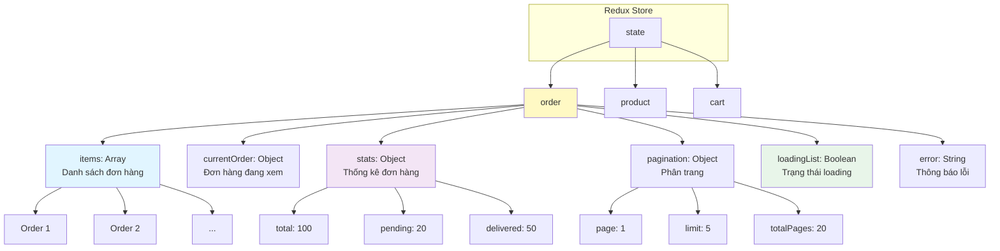

---

## 🚀 Timeline thực tế (milliseconds)

```mermaid
gantt
    title Redux Saga Order List Timeline
    dateFormat X
    axisFormat %L ms

    section Component
    Mount & Render          :0, 10
    Dispatch Action         :10, 20
    Re-render (Loading ON)  :30, 40
    Re-render (Show Data)   :330, 350

    section Redux
    Receive Action          :20, 30
    State Update (REQUEST)  :20, 30
    State Update (SUCCESS)  :320, 330

    section Saga
    Catch Action            :20, 40
    Call API                :40, 300
    Dispatch SUCCESS        :310, 320

    section Backend
    Receive Request         :50, 100
    Process Data            :100, 250
    Send Response           :250, 300
```

---

## 🔍 Chi tiết fetchOrdersSaga Flow

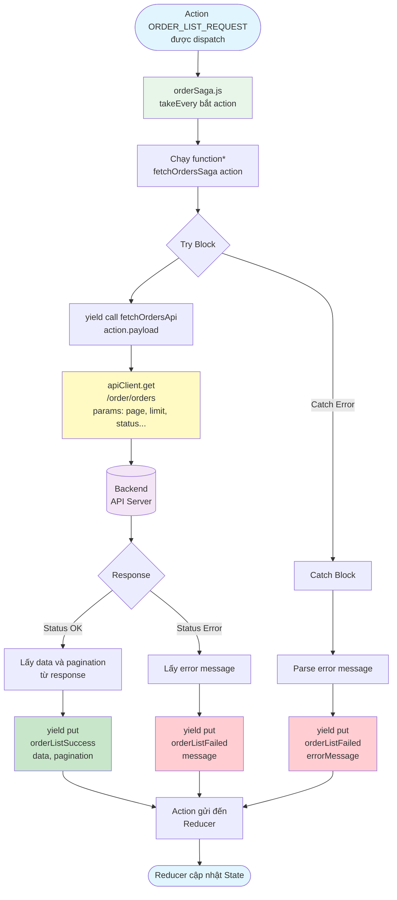

---

## 🎯 Action Types Pattern

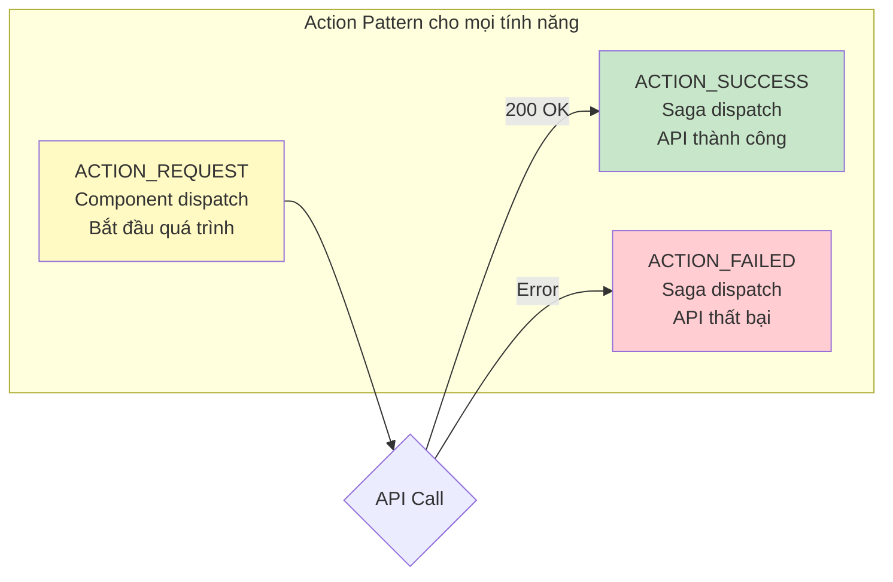

### Ví dụ cụ thể:

| Tính năng       | REQUEST                       | SUCCESS                       | FAILED                       |
| --------------- | ----------------------------- | ----------------------------- | ---------------------------- |
| Lấy danh sách   | `ORDER_LIST_REQUEST`          | `ORDER_LIST_SUCCESS`          | `ORDER_LIST_FAILED`          |
| Xem chi tiết    | `ORDER_DETAIL_REQUEST`        | `ORDER_DETAIL_SUCCESS`        | `ORDER_DETAIL_FAILED`        |
| Cập nhật status | `ORDER_UPDATE_STATUS_REQUEST` | `ORDER_UPDATE_STATUS_SUCCESS` | `ORDER_UPDATE_STATUS_FAILED` |
| Lấy thống kê    | `ORDER_STATS_REQUEST`         | `ORDER_STATS_SUCCESS`         | `ORDER_STATS_FAILED`         |

---

## 🔧 Component ↔️ Redux Communication

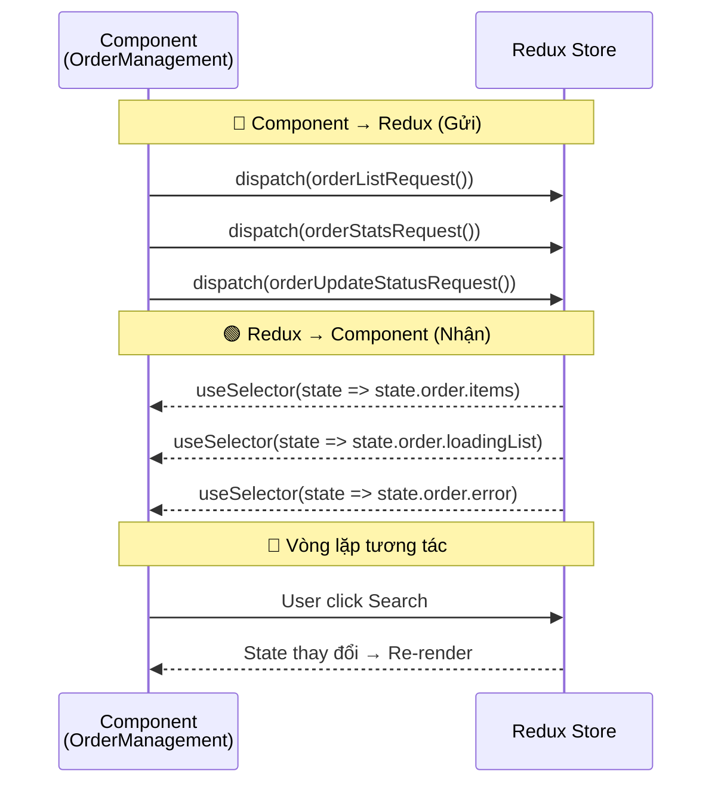

---

## 📱 Component Lifecycle với Redux

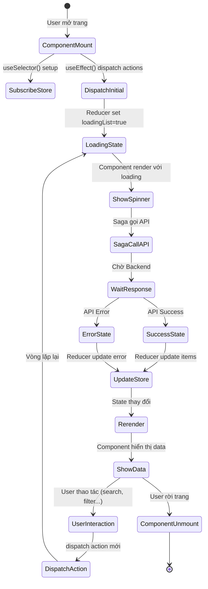

---

## 🎨 Data Flow trong Component

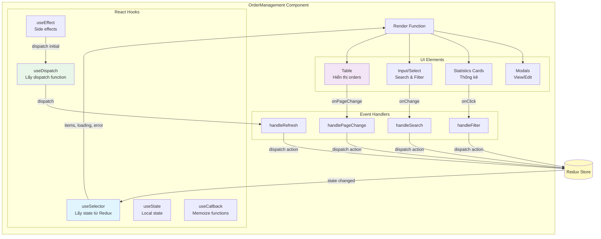

---

## 🎓 So sánh Redux vs Redux Saga

### ❌ Không dùng Redux Saga (Redux thuần):

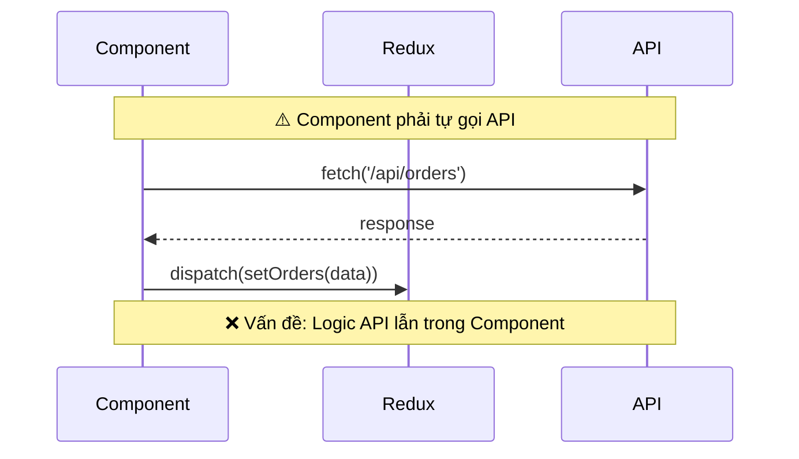

### ✅ Dùng Redux Saga (Tách biệt):

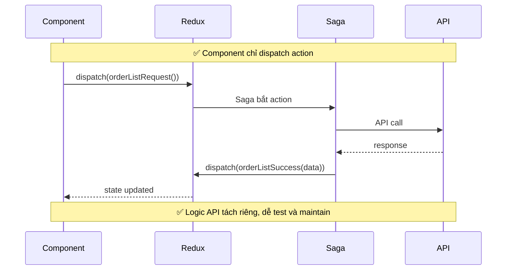

---

## 📊 State Flow với nhiều actions

```mermaid
graph TB
    Initial[Initial State<br/>items: []<br/>loadingList: false<br/>error: null]

    Initial -->|dispatch REQUEST| Loading[State khi loading<br/>items: []<br/>loadingList: true<br/>error: null]

    Loading -->|dispatch SUCCESS| Success[State khi thành công<br/>items: [10 orders]<br/>loadingList: false<br/>error: null]

    Loading -->|dispatch FAILED| Failed[State khi lỗi<br/>items: []<br/>loadingList: false<br/>error: 'Error message']

    Success -->|User search| Loading
    Failed -->|User retry| Loading
    Success -->|User refresh| Loading

    style Initial fill:#e3f2fd
    style Loading fill:#fff9c4
    style Success fill:#c8e6c9
    style Failed fill:#ffcdd2
```

---

## 🎯 Tổng kết Flow hoàn chỉnh

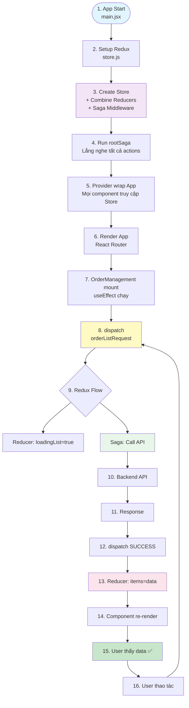

---

🎉 **Hy vọng những sơ đồ này giúp bạn hình dung rõ hơn về luồng Redux Saga!**
